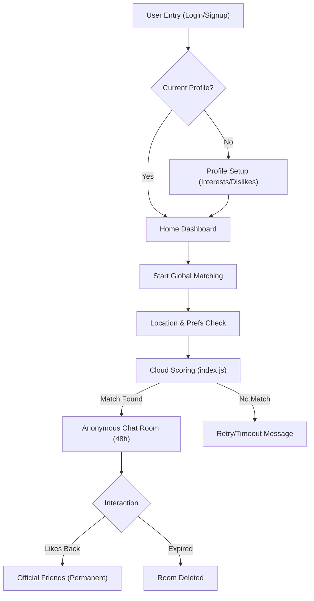

# Veil Chat 🎭

Veil Chat is a professional, high-performance messaging platform that balances the security of friendship with the excitement of anonymous discovery. It uses a cloud-powered matching engine to connect users based on deep compatibility rather than just proximity.

---

## 🚀 Key Functionality

### 1. **Hyper-Personalized Global Matching**
Our matching engine doesn't just look for "anyone online." It runs a multi-layered scoring algorithm in the cloud:
- **Strict Filtering**: Automatically excludes any user who has one of your **Deal-Breakers** as an interest.
- **Compatibility Scoring**: Factors in shared interests (40%), similar dislikes (10%), age proximity (20%), and physical location (15%).
- **Verification Bonus**: Verified users get a 15% prioritization boost to ensure high-quality matches.
- **Safety**: Matches are temporary (48-hour window) and anonymous until both users decide to become friends.

### 2. **Professional Chat Experience**
- **Real-time Engine**: Built on Firestore with zero-latency message delivery.
- **Rich Media**: Supports image sharing powered by Cloudinary and local camera integration.
- **Engagement Tools**: Message reactions (emoji), typing indicators, and detailed read receipts.
- **Persistence**: "Friends" keep their chat history forever; "Strangers" have a ticking timer until the connection expires.

### 3. **Privacy & Presence**
- **Advanced Presence**: Real-time "Online" status and "Last seen" timestamps.
- **Granular Privacy**: Toggle who sees your profile picture (Friends only vs. Everyone).
- **Control**: Block or report users directly from the chat menu with automatic moderator flagging.

---

## 🗺️ Application Flow



---

## 📊 Data Model (User)

The core `User` model is designed for flexibility and efficient cloud-querying.

| Field | Type | Description |
| :--- | :--- | :--- |
| `uid` | String | Unique Firebase Authentication ID |
| `fullName` | String | Display name shown to friends |
| `interests` | List<String> | Hobbies and passions (used for matching) |
| `chatPreferences` | Object | Includes `matchWithGender`, `ageRange`, and `onlyVerified` |
| `dealBreakers` | List<String> | Factors that disqualify a potential match |
| `location` | GeoPoint | Latitude/Longitude for distance calculation |
| `verificationLevel` | Integer | 1 for Base, 2 for Identity Verified |

---

## 🛠️ Installation & Setup

1. **Clone the repository**:
   ```bash
   git clone https://github.com/Sidd1374/Anonymous_Chat_Application.git
   cd Anonymous_Chat_Application
   ```

2. **Configure Flutter**:
   ```bash
   flutter pub get
   ```

3. **Configure Cloud Functions**:
   ```bash
   cd functions
   npm install
   cd ..
   ```

4. **Firebase Setup**:
   - Run `firebase login`.
   - Run `firebase use --add` (select your project).
   - Deploy matching logic: `firebase deploy --only functions`.

5. **Run the app**:
   ```bash
   flutter run
   ```

---

## 👨‍💻 Developer Details

**Siddharth Sharma**
- 📧 **Email**: [sidd13704@gmail.com](mailto:sidd13704@gmail.com)
- 🔗 **LinkedIn**: [Siddharth Sharma](https://www.linkedin.com/in/siddharthsharma1374)
- 💻 **GitHub**: [Sidd1374](https://github.com/Sidd1374)
- 📱 **Portfolio**: [siddharthsharma.dev](https://www.iamsidd.tech)

## 📜 License
This project is licensed under the MIT License.
