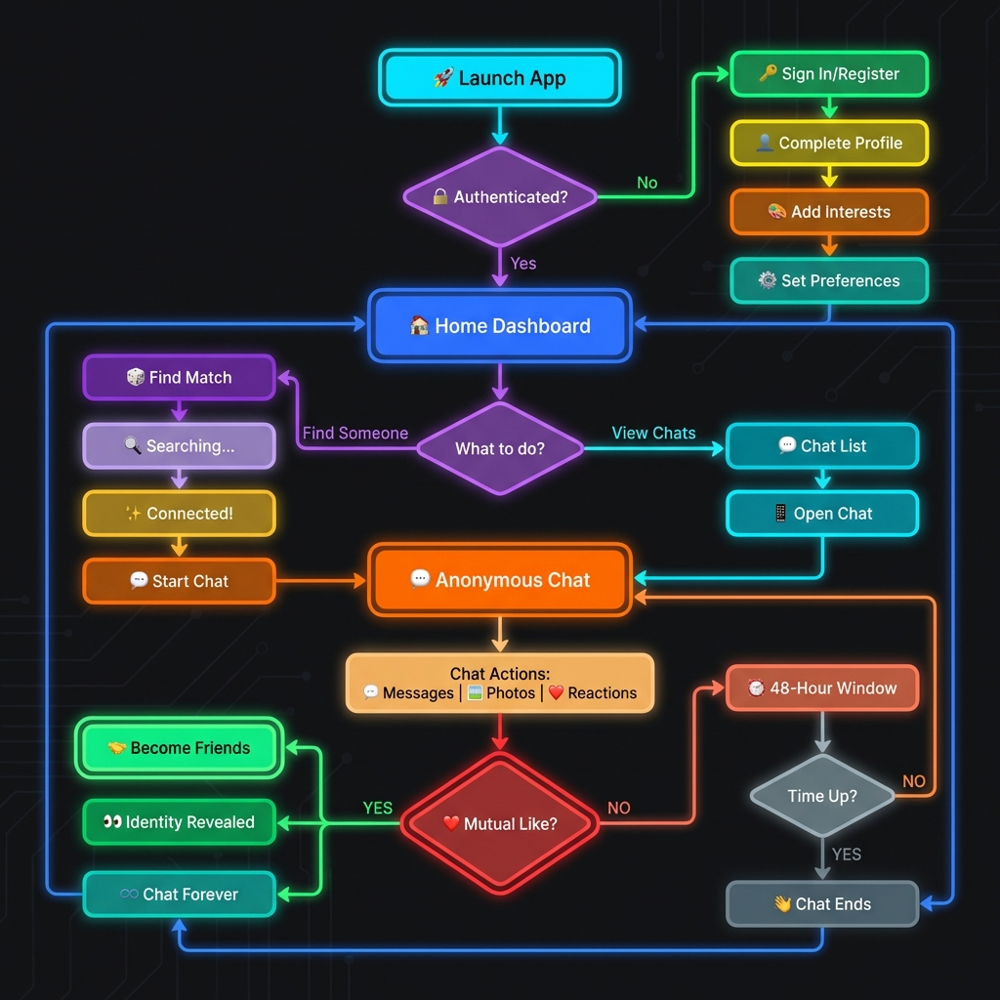

<p align="center">
   
</p>

<div align="center">

# VEIL Chat

</div>

<div align="center">

### *Where Strangers Become Stories*

[](https://flutter.dev)
[](https://firebase.google.com)
[](https://dart.dev)

*Anonymous connections. Real conversations. Your rules.*

</div>

---

## ✨ What is Veil?

> **Veil** strips away the noise of modern social apps. No followers. No likes. No algorithm-driven feeds. Just **real conversations** with compatible strangers who might just become lifelong friends.

```
🎲 Match → 💬 Chat → ❤️ Connect → 🤝 Friends Forever
```

---

## 🚀 Core Features

<table>
<tr>
<td width="50%">

### 🎯 Smart Matching Engine
- **AI-Powered Compatibility** scoring
- **Deal-breaker filtering** — avoid mismatches
- **Location-aware** global connections
- **Verification boost** for quality matches

</td>
<td width="50%">

### 💬 Premium Chat Experience  
- **Real-time** messaging with read receipts
- **Image sharing** via Cloudinary CDN
- **Message reactions** & typing indicators
- **Smart caching** — zero loading lag

</td>
</tr>
<tr>
<td width="50%">

### 🔒 Privacy First
- **48-hour anonymous window** before reveal
- **Granular controls** — who sees what
- **Block & Report** with moderator flagging
- **Offline mode** with data persistence

</td>
<td width="50%">

### 👥 Dual Relationship System
- **Strangers** — temporary, exciting, anonymous
- **Friends** — permanent, trusted, full access
- **Mutual like** = instant friendship upgrade
- **Chat history** preserved for friends

</td>
</tr>
</table>

---

## 🧠 The Magic Behind Matching

```
┌─────────────────────────────────────────────────────────┐
│                  COMPATIBILITY SCORE                     │
├─────────────────────────────────────────────────────────┤
│  🎨 Shared Interests   ████████████████░░  40%          │
│  📍 Location Proximity █████████░░░░░░░░░  20%          │
│  🎂 Age Compatibility  ██████████░░░░░░░░  20%          │
│  ✅ Verification Bonus ███████░░░░░░░░░░░  15%          │
│  🚫 Anti-Dealbreaker   ██░░░░░░░░░░░░░░░░   5%          │
└─────────────────────────────────────────────────────────┘
```

---

## 📱 App Journey

<div align="center">
  
</div>

### 🎯 Journey Breakdown

<table>
<tr>
<td width="33%">

**🔰 Onboarding Phase**
1. 🚀 Launch the app
2. 🔐 Authenticate (Sign in/Register)
3. 👤 Complete your profile
4. 🎨 Add interests & preferences
5. ⚙️ Set matching preferences

</td>
<td width="33%">

**🎲 Matching Phase**
1. 🏠 Access Home Dashboard
2. 🎲 Tap "Find Match"
3. 🔍 AI searches for compatible stranger
4. ✨ Get matched instantly
5. 💬 Start anonymous conversation

</td>
<td width="34%">

**❤️ Connection Phase**
1. 💭 Chat anonymously (48h window)
2. 🖼️ Share images & reactions
3. ❤️ Like each other mutually
4. 🤝 Become friends (reveal identities)
5. ♾️ Continue chatting forever!

</td>
</tr>
</table>

---

## ⚡ Performance Optimizations

| Feature | Impact |
|---------|--------|
| 🗄️ **Aggressive Caching** | User data cached until logout |
| 📡 **Smart Streams** | Real-time updates without re-fetching |
| 🖼️ **Image CDN** | Cloudinary for blazing-fast media |
| 💾 **Offline Support** | SharedPreferences persistence |
| 🔄 **Pull-to-Refresh** | On-demand data refresh only |

---

## 🛠️ Quick Start

```bash
# Clone & Setup
git clone https://github.com/Sidd1374/Anonymous_Chat_Application.git
cd Anonymous_Chat_Application

# Install dependencies
flutter pub get
cd functions && npm install && cd ..

# Configure Firebase
firebase login && firebase use --add

# Deploy cloud functions
firebase deploy --only functions

# Launch! 🚀
flutter run
```

---

## 🏗️ Tech Stack

<div align="center">

| Layer | Technology |
|:-----:|:----------:|
| **Frontend** | Flutter + Dart |
| **Backend** | Firebase (Auth, Firestore, Functions) |
| **Media** | Cloudinary CDN |
| **Notifications** | FCM + Local Notifications |
| **State** | Provider + SharedPreferences |

</div>

---

## 👨‍💻 Developer

<div align="center">

**Siddharth Sharma**

[](mailto:sidd13704@gmail.com)
[](https://www.linkedin.com/in/siddharthsharma1374)
[](https://github.com/Sidd1374)
[](https://www.iamsidd.tech)

</div>

---

<div align="center">

### 📜 License

MIT License — Build something amazing! 🚀

---


</div>

